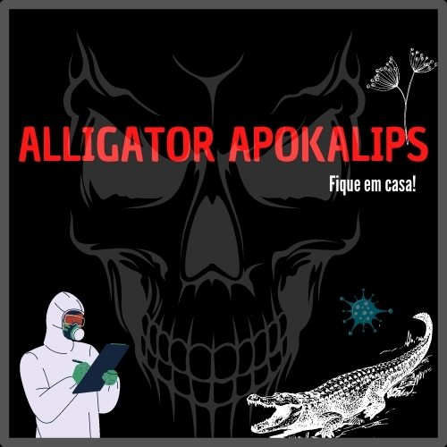

# Projeto Final- Módulo 1
### Jogo desenvolvido como Projeto Final do Módulo 1 - Introdução ao Python do curso vamo AI, *parceria entre o iFood e a Resilia Educação*.

#  :crocodile: ALLIGATOR APOKALIPS :crocodile:

---

## **História**:notebook_with_decorative_cover: 
Tudo começou em fevereiro de 2020, quando médicos brasileiros descobrem que um vírus está circulando pelo Brasil transformando as pessoas em répteis.    Especificamente em JACARÉS! Já se sabe o criador desse vírus, Dr Bobonaro Jayme. Ele fez uma revelação em um vídeo publicado no Youtube e suicidou - se logo após. Você foi convidado pelo Presidente do Brasil, Tancredu Neives, para ser Ministro da Saúde. Terá o papel de DETER que o vírus SE ESPALHE pelo Brasil e pelos outros países transformando a Humanidade em Jacarés.
O Vírus está se espalhando pelo Brasil, mas você poderá deter. Suas escolhas poderão lhe tornar um herói ou heroína.

---
## **Personagens**
   
 -
 - ### **Doutor Odisvaldo Cruz** - Graduado em Biologia, Mestre em Microbilogia ambos pela Universidade Federal da Bahia. Doutor em Genética Molecular e de Micro - organismos pela Harvard University.
 - ### **Doutora Alessya Bonay** - Graduada em Medicina pela Universidade Federal do Rio de Janeiro. Mestre em Microbiologia pela Universidade do Estado do Rio de Jneiro. Doutora em Ciências Biométicas pela Stanford University.
 - ### **Doutor Nelson Tati** - Graduado em Medicina pela Universidade Federal do Acre. Mestre e Doutor em Ciências Biomédicas pela University of Portsmouth.
 ---
 # Locais 
 - ## Interior do Acre 
 - ## Mata Amazônica
 - ## Interior da Bahia
 - ## EUA
 - ## Nascente em Petrópolis

---
# Condições de Vitória:trophy: 
### O Jogo Alligator Apokalips é uma paródia do cenário atual Brasileiro. Precisará ficar atento que fazer Lockdown, investir em Pesquisa/Educação procurar as fontes de cura são essenciais para vencer o jogo.
- ### **Para Vencer:**  
    - Lockdown , Investir em Pesquisa Nacional e Planta Empatia no Interior do Acre.
    - Lockdow , Investir em Pesquisa Nascional e água da Nascente em Petrópolis.
---
# Condições de Derrota :skull:   
- **Para Perder:**  
  - Não fazer Lockdown
  - Não investir em Pesquisa
  - Pedir ajuda ao EUA
  - Não coletar a Planta Empatia
  - Não coletar a Água da Nascente Esperança

---
## Créditos finais:
### Fontes:
- https://fsymbols.com/pt/arte-de-texto/
- https://www.patorjk.com/software/taag/#p=display&f=Ogre&t=ramon%20pika%20das%20galaxia

 

### Obrigado e Bye bye !! :stuck_out_tongue_winking_eye: :punch: :laughing: 
